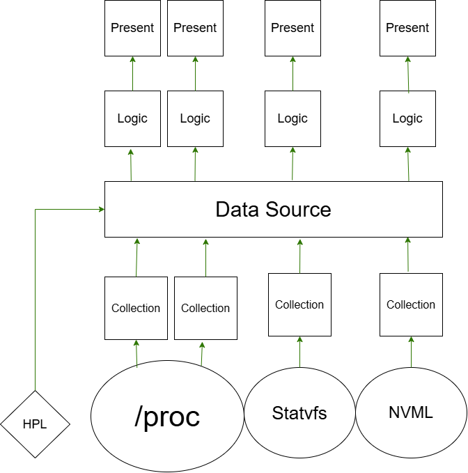

## Architecture

 
 
 
## illustrate
### HPL(Hardware Protool Layer) : 
#### Dynamically calculates the exact number of hardware threads for any host CPU in Initialization phase, This can make calculate the fixed size array CPU needs

### Collection Layer : 
#### Parses raw kernel telemetry (/proc/stat, /proc/cpuinfo, /proc/meminfo, statvfs, NVML) directly into byte slices and writes them into pre-allocated, cache-aligned memory slots with zero per-telemetry heap allocations

### Data Source : 
#### Designed a polymorphic shared memory architecture using a fixed-size byte array across all metric modules, maximizing memory reuse and minimizing footprint and explicit 16-byte memory alignment for CPU thread slots to ensure peak cache efficiency

### Logic Layer :
#### Processes hardware state transitions and computes real-time metric deltas (e.g., CPU usage rates via byte-slice conversions) directly within contiguous buffers, pumping calculated metrics straight to the chart arrays for the UI presentation layer

### Present Layer :
#### Built an event-driven, single-threaded loop (`event::poll` with 1s timeout) that fetches target hardware metrics on-demand based on UI interaction (`A`/`D` navigation, `Q` exit). Completely eliminates thread context-switching overhead, mutex contention, and data races while controlling sampling frequency
 
 
 

## Telemetry Ingestion & Processing Pipeline
Experimental computer :
####    OS: Ubuntu 24.04.4 LTS (Noble Numbat) x86_64
####    CPU: AMD Ryzen 5 2600 (12) @ 3.40 GHz
####    GPU: NVIDIA GeForce GTX 1660 [Discrete]
####    Memory: 4.05 GiB / 15.56 GiB
####    Disk (/): 66.96 GiB / 456.35 GiB (15%) - ext4

     
Empirical micro-benchmarks executed using `Criterion` (100 samples per module). The measurements capture the complete end-to-end execution cost, including Linux kernel sys-calls, C-FFI overhead, and in-memory delta calculations:

| Benchmark Target | Latency | Primary Operation & Bottleneck |
| :--- | :--- | :--- |
| **`bench_cpu_module`** | **`101.06 µs`** | Parsing `/proc/stat` & `/proc/cpuinfo` for 16 threads |
| **`bench_gpu_module`** | **`47.795 µs`** | NVML C-FFI driver query via C boundary |
| **`bench_mem_module`** | **`12.335 µs µs`** | Byte-scanning `/proc/meminfo` metrics |
| **`bench_disk_module`** | **`1.3708 µs µs`** | Real `statvfs` Linux kernel syscall & buffer mapping |
| **`Full Telemetry Cycle`** | **`~162.5608 µs`** | **End-to-end telemetry ingestion + delta logic** |

---

